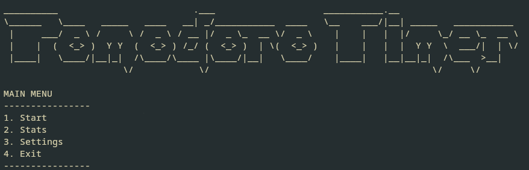

# pomodoro-go
Simple Pomodoro Timer CLI made with GO

### Quick Start
Use `go run main.go` to start the file

### Usage
I made this timer quickly for myself, there is currently no error checking on any inputs that is not an **int**. Please be wary of this.
